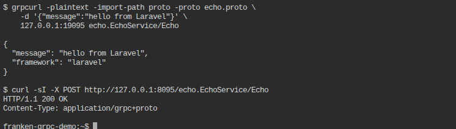

# Laravel example

Files in this directory, dropped into a fresh `laravel/laravel` skeleton:

- `routes/api.php` — the catch-all route
- `bootstrap-app.php` — save as `bootstrap/app.php`; the key line is
  `apiPrefix: ''`
- `app/Http/Controllers/GrpcController.php`

## Setup

```bash
composer create-project laravel/laravel .
composer require cleatsquad/php-grpc-frame-codec google/protobuf

# generate stubs from ../proto/echo.proto (php_namespace option already
# points them at EchoGrpc\, matching the composer.json psr-4 entry below)
protoc --proto_path=../proto --php_out=app ../proto/echo.proto
```

Add to `composer.json`'s `autoload.psr-4`:

```json
"EchoGrpc\\": "app/EchoGrpc/"
```

Copy the three files from this directory into place, then:

```bash
composer dump-autoload
php artisan route:clear   # picks up bootstrap/app.php changes
php -S 0.0.0.0:8080 -t public
```

## Two things that aren't obvious until you run it

1. **The `api` routing group prefixes every path with `/api`** — franken-grpc
   POSTs to the literal path `/echo.EchoService/Echo`, which never matches
   `/api/echo.EchoService/Echo`. `apiPrefix: ''` in `bootstrap/app.php`
   removes it.
2. **The `web` group's CSRF middleware would reject this POST outright** —
   put the route on `api`, not `web`.

## Proof this actually ran

```
$ grpcurl -plaintext -import-path proto -proto echo.proto \
    -d '{"message":"hello from Laravel"}' \
    127.0.0.1:19095 echo.EchoService/Echo

{
  "message": "hello from Laravel",
  "framework": "laravel"
}

$ curl -sI -X POST http://127.0.0.1:8095/echo.EchoService/Echo
HTTP/1.1 200 OK
Content-Type: application/grpc+proto
```


