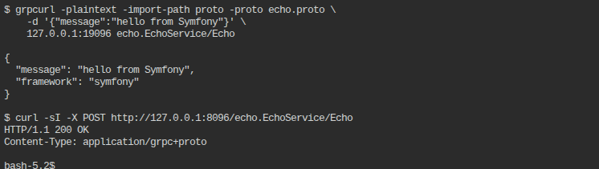

# Symfony example

Files in this directory, dropped into a fresh `symfony/skeleton`:

- `src/Controller/GrpcController.php` — route attribute + handler
- `config/services.yaml` — the line that matters is the last one

## Setup

```bash
composer create-project symfony/skeleton .
composer require cleatsquad/php-grpc-frame-codec google/protobuf

# generate stubs from ../proto/echo.proto (php_namespace option already
# points them at EchoGrpc\, matching the composer.json psr-4 entry below)
protoc --proto_path=../proto --php_out=src ../proto/echo.proto
```

Add to `composer.json`'s `autoload.psr-4`:

```json
"EchoGrpc\\": "src/EchoGrpc/"
```

Copy the two files from this directory into place (merge `services.yaml`
into your own — don't overwrite the `App\:` block), then:

```bash
composer dump-autoload
APP_ENV=dev php -S 0.0.0.0:8080 -t public
```

## The one thing that isn't obvious until you run it

Symfony's `_defaults: autowire: true` only auto-registers classes matched
by the `App\:` resource block — a vendor class like `GrpcFrameCodec`
isn't covered by that, and the container fails at boot with
`argument "$codec" ... references class "..." but no such service exists`
until it's declared explicitly:

```yaml
services:
    CleatSquad\GrpcFrameCodec\GrpcFrameCodec: ~
```

## Proof this actually ran

```
$ grpcurl -plaintext -import-path proto -proto echo.proto \
    -d '{"message":"hello from Symfony"}' \
    127.0.0.1:19096 echo.EchoService/Echo

{
  "message": "hello from Symfony",
  "framework": "symfony"
}

$ curl -sI -X POST http://127.0.0.1:8096/echo.EchoService/Echo
HTTP/1.1 200 OK
Content-Type: application/grpc+proto
```


